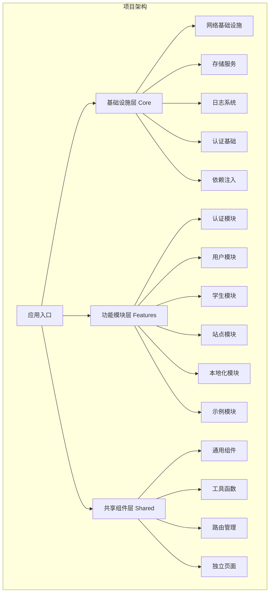
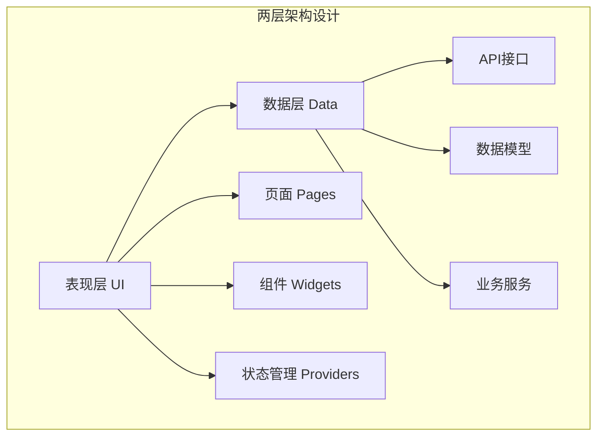
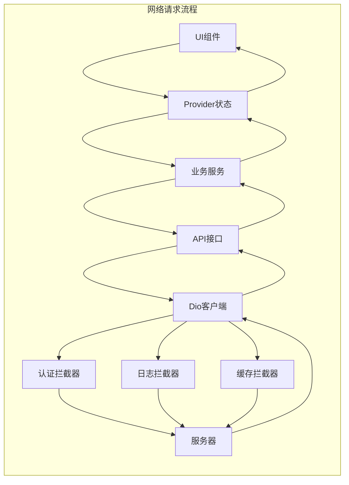
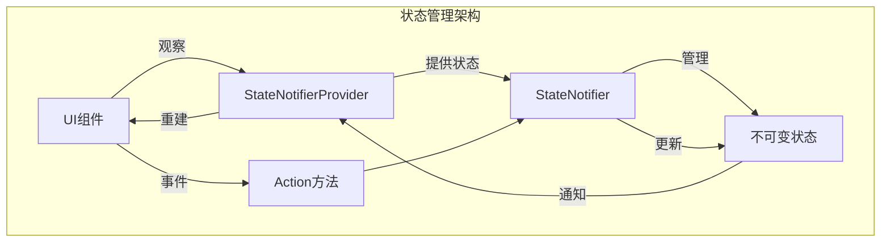
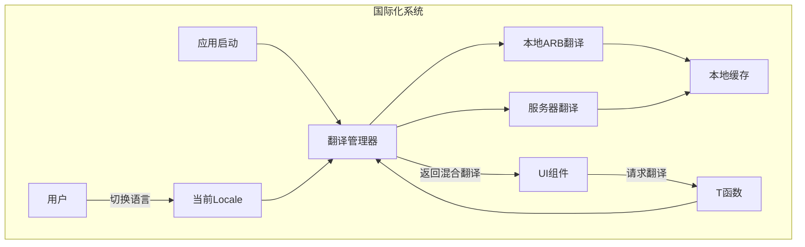
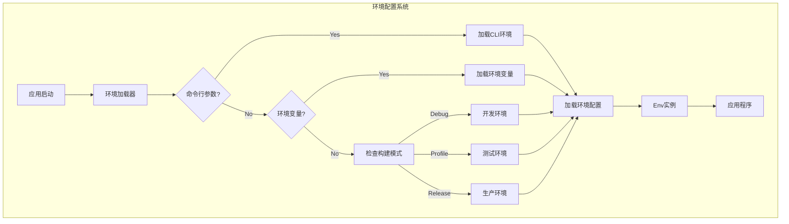
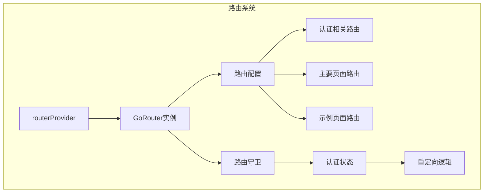
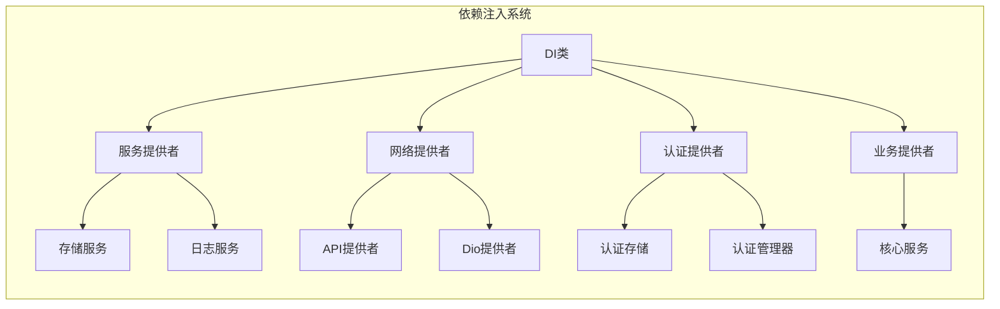

# Flutter模块化架构项目说明

## 1. 项目概述

本项目是一个基于Flutter的模块化架构应用，采用现代化的分层设计，展示了移动应用开发的最佳实践。项目特点包括：

- **功能模块化设计**：每个功能模块独立封装，边界清晰
- **分层架构**：清晰的数据层、业务层和表现层分离
- **响应式状态管理**：基于Riverpod的响应式状态管理
- **灵活的网络请求系统**：Dio + Retrofit组合
- **混合式国际化方案**：本地ARB文件结合服务器动态翻译
- **多环境配置**：支持开发、测试和生产环境配置

## 2. 架构设计

### 2.1 架构总览



### 2.2 分层架构

项目采用两层架构设计（在更早的设计中使用了三层架构，目前简化为两层）：



### 2.3 目录结构

项目目录结构清晰组织，便于维护和扩展：

```
lib/
├── 📄 main.dart                           # 应用入口
│
├── 📁 app/                                # 应用配置
│   ├── app.dart                           # 应用主组件
│   ├── config/                            # 配置文件
│   └── theme/                             # 主题配置
│
├── 📁 core/                               # 基础设施层
│   ├── network/                           # 网络基础设施
│   │   ├── interceptors/                  # 拦截器
│   │   ├── config/                        # 网络配置
│   │   ├── client/                        # API客户端
│   │   └── models/                        # 网络模型
│   ├── storage/                           # 存储服务
│   ├── logger/                            # 日志系统
│   ├── auth/                              # 认证基础服务
│   ├── localization/                      # 本地化配置
│   └── di/                                # 依赖注入
│
├── 📁 features/                           # 功能模块层
│   ├── auth/                              # 认证模块
│   │   ├── auth.dart                      # 模块导出
│   │   ├── data/                          # 数据层
│   │   │   ├── api/                       # API接口
│   │   │   ├── models/                    # 数据模型
│   │   │   └── services/                  # 业务服务
│   │   └── ui/                            # 表现层
│   │       ├── pages/                     # 页面
│   │       ├── widgets/                   # 组件
│   │       └── providers/                 # 状态管理
│   ├── user/                              # 用户模块
│   ├── student/                           # 学生模块
│   ├── site/                              # 站点模块
│   ├── localization/                      # 本地化模块
│   └── examples/                          # 示例模块
│
├── 📁 shared/                             # 共享组件层
│   ├── widgets/                           # 通用UI组件
│   ├── utils/                             # 业务工具
│   ├── router/                            # 路由配置
│   └── pages/                             # 独立页面
│
├── 📁 l10n/                               # 国际化资源
│   ├── arb/                               # ARB翻译文件
│   └── generated/                         # 生成的代码
│
└── 📁 env/                                # 环境配置
    ├── env_loader.dart                    # 环境加载器
    └── index.dart                         # 环境配置类
```

## 3. 核心技术实现

### 3.1 网络请求系统

网络请求系统基于Dio和Retrofit构建，支持拦截器、缓存、错误处理等特性：



系统特点：
- DioClient工厂类统一管理Dio实例
- 默认、认证、缓存、日志拦截器链
- 支持多API端点配置
- 请求自动重试机制
- 离线数据缓存支持

### 3.2 状态管理方案

项目使用Flutter Riverpod进行状态管理，采用以下模式：



特点：
- 基于StateNotifier的不可变状态
- 集中化状态管理
- 依赖注入与状态管理集成
- 状态继承自清晰的基类

### 3.3 国际化系统

项目采用混合式国际化解决方案，结合Flutter内置的ARB机制和服务器端动态翻译：



特点：
- 统一的翻译接口（T函数）
- 服务器翻译动态加载
- 本地翻译作为后备
- 翻译优先级控制

### 3.4 环境配置系统

系统支持多种环境配置，通过环境变量和构建参数灵活切换：



环境文件布局：
- `assets/env/env.common` - 公共配置
- `assets/env/env.development` - 开发环境配置
- `assets/env/env.staging` - 测试环境配置
- `assets/env/env.production` - 生产环境配置

## 4. 功能模块说明

### 4.1 认证模块

认证模块提供用户身份验证、授权和账户管理功能：
- 登录与注册
- Token管理与刷新
- 认证状态管理
- 用户资料管理

### 4.2 用户模块

用户模块处理用户信息管理和个性化设置：
- 用户信息展示与编辑
- 用户偏好设置
- 用户权限管理

### 4.3 学生模块

学生模块提供学生相关功能：
- 学生信息管理
- 学生课程关联
- 学习记录跟踪

### 4.4 站点模块

站点模块负责应用的站点配置：
- 站点信息管理
- 站点设置与配置
- 站点统计数据

### 4.5 本地化模块

本地化模块实现多语言支持：
- 语言切换功能
- 本地ARB翻译
- 服务器翻译获取
- 翻译缓存管理

### 4.6 示例模块

示例模块提供各种功能演示：
- 状态管理演示
- 网络请求演示
- UI组件演示
- 工具功能演示

## 5. 路由与导航

项目使用go_router实现基于Navigator 2.0的声明式路由：



特点：
- 命名路由管理
- 基于状态的路由守卫
- 路由参数传递
- 页面转场动画
- 深度链接支持

## 6. 依赖注入

项目使用自定义的依赖注入系统，基于Riverpod提供者：



特点：
- 集中式依赖管理
- 基于Provider的依赖注入
- 延迟初始化支持
- 类分组组织

## 7. 开发指南

### 7.1 新增功能模块

添加新功能模块的标准流程：

1. 在`lib/features/`下创建新模块目录
2. 创建模块结构（data和ui两层）
3. 实现API接口和数据模型
4. 实现业务服务和状态管理
5. 开发UI界面和组件
6. 创建模块导出文件
7. 注册路由和依赖项

### 7.2 状态管理最佳实践

1. 创建状态模型类
```dart
class ExampleState {
  final List<ExampleItem> items;
  final bool isLoading;
  final String? error;
  
  const ExampleState({
    this.items = const [],
    this.isLoading = false,
    this.error,
  });
  
  ExampleState copyWith({
    List<ExampleItem>? items,
    bool? isLoading,
    String? error,
  }) {
    return ExampleState(
      items: items ?? this.items,
      isLoading: isLoading ?? this.isLoading,
      error: error ?? this.error,
    );
  }
}
```

2. 创建StateNotifier
```dart
class ExampleNotifier extends StateNotifier<ExampleState> {
  final ExampleService _service;
  
  ExampleNotifier(this._service) : super(const ExampleState());
  
  Future<void> loadItems() async {
    state = state.copyWith(isLoading: true);
    try {
      final items = await _service.getItems();
      state = state.copyWith(
        items: items,
        isLoading: false,
        error: null,
      );
    } catch (e) {
      state = state.copyWith(
        isLoading: false,
        error: e.toString(),
      );
    }
  }
  
  // 其他方法...
}
```

3. 创建Provider
```dart
final exampleServiceProvider = Provider<ExampleService>((ref) {
  final api = ref.watch(exampleApiProvider);
  return ExampleService(api);
});

final exampleProvider = StateNotifierProvider<ExampleNotifier, ExampleState>((ref) {
  final service = ref.watch(exampleServiceProvider);
  return ExampleNotifier(service);
});
```

### 7.3 API模型开发

1. 创建数据模型
```dart
@MappableClass()
class ExampleModel with ExampleModelMappable {
  final int? id;
  final String? name;
  
  const ExampleModel({this.id, this.name});
  
  static const fromJson = ExampleModelMapper.fromJson;
}
```

2. 创建API接口
```dart
@RestApi()
abstract class ExampleApi {
  factory ExampleApi(Dio dio) = _ExampleApi;
  
  @GET('/examples')
  Future<ApiResponse<List<ExampleModel>>> getExamples();
  
  @GET('/examples/{id}')
  Future<ApiResponse<ExampleModel>> getExample(@Path('id') int id);
}
```

## 8. 技术栈

项目使用的主要依赖：
- **Flutter SDK**: ^3.0.0
- **Dart SDK**: ^3.0.0
- **状态管理**: flutter_riverpod ^2.4.10
- **网络请求**: dio ^5.3.4, retrofit ^4.0.3
- **本地存储**: shared_preferences ^2.2.2
- **数据映射**: dart_mappable ^4.2.0
- **路由管理**: go_router ^12.0.1
- **环境配置**: flutter_dotenv ^5.1.0
- **时间处理**: ntp ^2.0.0, timezone ^0.9.2
- **国际化**: intl ^0.18.1
- **日志**: logger ^2.0.2


## 9 备用UI参考
- forui： https://forui.dev/docs/layout/scaffold
- https://docs.getwidget.dev/introduction/
- https://sunarya-thito.github.io/shadcn_flutter/
- https://fluttergems.dev/

## 9. 总结

本项目展示了一种现代化的Flutter应用架构设计，通过模块化和分层设计实现了高内聚、低耦合的代码组织。采用Riverpod状态管理和Dio+Retrofit网络请求方案，提供了清晰的数据流和业务逻辑处理方式。项目的架构设计满足了可扩展性、可测试性和可维护性的需求，适用于中大型Flutter应用开发。 